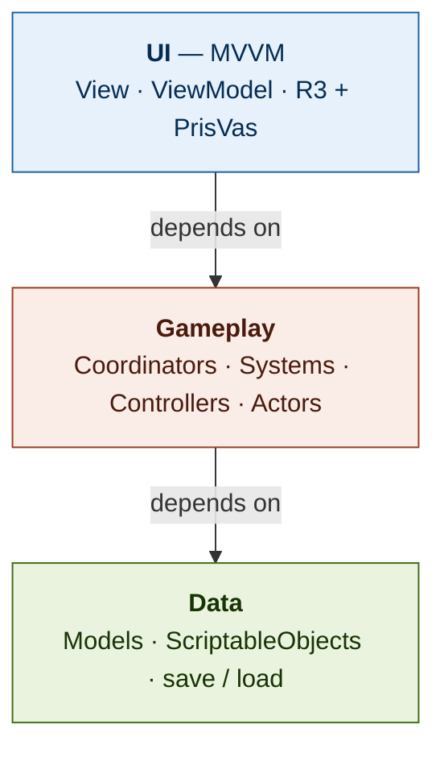

# Engineering Conventions & Project Foundation

> **UnsafeContext — baseline for every Unity project.** Single source of truth.
> Copy into each repo root as `ARCHITECTURE.md`, next to the shared `.editorconfig`.
> When a decision isn't covered here, prefer the choice that keeps gameplay logic
> in plain testable C# and keeps `MonoBehaviour`s humble.

---

## 0. How to use this

1. Drop `.editorconfig` in the repo root — it enforces the lint/naming rules below.
2. Keep this file as the architecture contract. PRs that violate a **Hard Rule** (§7) get rejected.
3. New project? Start from §12 (folders) and §5 (taxonomy). Don't write a class until you can name which archetype it is.

The lint catches *style*. This document governs *structure*. The lint cannot tell that a class sits in the wrong layer — that is a review responsibility.

---

## 1. Tooling & enforcement

- **Lint:** `.editorconfig` (companion file). Rider and Visual Studio both honor it. Do not override per-project.
- **Analyzers:** keep Roslyn analyzers on. In CI / release builds, treat warnings as errors so naming drift cannot merge.
- **Editor:** Rider preferred (better Unity + analyzer integration), Visual Studio acceptable. Format-on-save on.
- **One formatting authority:** the `.editorconfig`. No personal reformatting that fights it.

---

## 2. Naming conventions (Microsoft C#)

| Element | Convention | Example |
|---|---|---|
| Class, struct, enum, method, property | `PascalCase` | `EnemyController`, `TakeDamage` |
| Interface | `I` + `PascalCase` | `IInputProvider` |
| Type parameter | `T` + `PascalCase` | `TState` |
| Private instance field | `_camelCase` | `_attackTimer` |
| Private static field | `s_camelCase` | `s_instances` |
| Constant (any visibility) | `PascalCase` | `JumpForce` |
| Local variable, parameter | `camelCase` | `deltaTime` |
| Boolean | `Is` / `Has` / `Can` prefix | `IsGrounded`, `HasTarget` |
| Event | `On` + verb | `OnDefeated`, `OnHealthChanged` |
| Async method | `Async` suffix | `LoadLevelAsync` |
| Inspector field | `[SerializeField] private _camelCase` | `[SerializeField] private float _laneWidth;` |

**Reference:** these conventions follow Microsoft's [C# identifier naming rules and conventions](https://learn.microsoft.com/en-us/dotnet/csharp/fundamentals/coding-style/identifier-names), which adopt the .NET Runtime team's coding style — including the `_` prefix for private instance fields and `s_` for private statics. The `.editorconfig` enforces the enforceable parts.

**Field rules (Unity-specific; the lint cannot fully enforce these — uphold them in review):**

- **No `public` fields.** Expose via property if it must be public. Inspector access is `[SerializeField] private`.
- Prefer `readonly` for fields set only in the constructor.
- `const` for compile-time constants, `static readonly` for runtime ones.
- One type per file; file name matches type name.

---

## 3. Async — UniTask, not Task

- Use `UniTask` / `UniTaskVoid` instead of `Task` / `Coroutine` for logic flows. Zero-alloc, integrates with the player loop.
- Always thread a `CancellationToken`. For `MonoBehaviour`s use `this.GetCancellationTokenOnDestroy()`. Async work that outlives its owner is a bug.
- No `async void` except top-level event handlers that cannot be changed. Use `UniTaskVoid` + `.Forget()`, and only `.Forget()` deliberately — never to silence a token that should have been awaited.
- Coroutines are allowed only for trivial, view-local timeline effects — never for game logic.

---

## 4. The layer model

Four layers plus cross-cutting utilities. Dependencies point **down only**.



- Dependencies point **down only**: UI may depend on Gameplay, Gameplay on Data — never upward. Gameplay must not reference UI; it raises events/messages, UI listens.
- **VContainer** wires all three layers at the composition root — never mid-frame.
- **Cross-cutting** utilities (UniTask, DOTween, MessagePipe) are available to every layer.

---

## 5. Class taxonomy — *what is this class?*

Decide the archetype before writing the class. Skipping this step is what lets one pattern (e.g. "ViewModel") leak across layers where it does not belong.

> **Decision order — ask in sequence, stop at the first yes:**
> 1. Is it just **state/data**? → **Model** (POCO) or **ScriptableObject** (content).
> 2. Does it adapt model state to a **UI screen** via R3 bindings? → **ViewModel**.
> 3. Is it a `MonoBehaviour` that only renders / forwards input, no decisions? → **View** (UI) or **Actor** (gameplay).
> 4. Does it drive **one actor's** behavior/decisions (player, enemy, hero)? → **Controller**.
> 5. Does it apply rules across **many** entities, ticked by the loop? → **System**.
> 6. Does it orchestrate **one scene/mode's** flow (wire entities + systems + UI)? → **Coordinator**.
> 7. Is it an injectable **capability** (save, audio, input, time)? → **Service** (or **Provider**).
>
> If the honest answer is "it does several of these," split it.

### The archetypes

**Model** — pure state and invariants, no behavior beyond guarding its own data. POCO for runtime state, `ScriptableObject` for designer-authored content. No Unity API in runtime-state models.

**ViewModel** — *UI only.* Adapts a Model into bindable state for exactly one View, using R3 `ReactiveProperty`/observables consumed by PrisVas binders. **No `Tick`, no physics, no AI, no combat.** A class with those responsibilities is a Controller, not a ViewModel. One per screen/widget; lifetime is the screen.

**View** — *UI only.* Humble `MonoBehaviour` (uGUI). Binds to one ViewModel, applies UI visuals, forwards UI input. **Makes no decisions.** The gameplay equivalent is the **Actor** below — the `View` suffix is reserved for UI so the two layers never share a name.

**Actor** — *gameplay only.* The humble `MonoBehaviour` that is the physical presence of one actor in the scene: it owns the GameObject's components (collider, `CharacterController`, renderer, animator), subscribes to its Controller's events, and applies position/animation/VFX. **Makes no decisions, runs no rules.** Example: a projectile Actor moves toward its target and fires a hit callback — the damage stays with the Coordinator. Pairs one-to-one with a Controller.

**Controller** — drives **one** gameplay actor's behavior: input/AI → state → decisions. Plain C# (no `MonoBehaviour`) so it is unit-testable. Holds the state machine, exposes the actor's logical position/state, emits `event Action` (or MessagePipe messages) outward; a Coordinator or System ticks it. Pairs with an Actor that renders it. **Never named `ViewModel`** — that name is reserved for the UI layer (§9).

**System** — owns a slice of rules across **many** entities (spawning, damage, compliance). Mostly stateless; ticked by the game loop. Registered in DI, scoped to where it is relevant.

**Coordinator** — orchestrates one scene/mode: instantiates entities, wires Controllers ↔ Actors ↔ Systems ↔ UI, **owns the per-frame tick of its actors**, and applies cross-actor effects such as damage. One per mode/scene; lifetime is the scene.

**Service / Provider** — an injectable capability behind an interface (`ISaveService`, `IAudioService`, `IInputProvider`). Single instance per DI scope, **not** a singleton. A *Provider* is a Service that supplies data or an abstraction over a subsystem. See §6.

### "Manager" vs "Controller"

**`Manager` is a smell.** It almost always means a god object or a disguised singleton. Before writing `XxxManager`, force a precise answer:

- Manages **one** actor's behavior → it is a **Controller**.
- Manages **many** entities by rules → it is a **System**.
- Manages a **scene/mode's** flow → it is a **Coordinator**.
- Provides a **global capability** (audio, save, time) → it is a **Service**.

Reserve `Manager` for nothing. At most, a single thin bootstrap that builds the root DI scope — and that is better named `GameInstaller` or `Bootstrap`.

---

## 6. Dependency injection & services (no Service Locator)

All wiring goes through the DI container (VContainer). Two things must be right: how dependencies arrive, and where the container is allowed to be touched.

### Constructor injection is the default

A class declares what it needs in its constructor; the container supplies it at the composition root. Dependencies are explicit, visible, and compiler-checked.

```csharp
public sealed class SaveCoordinator
{
    private readonly ISaveService _save;
    private readonly IClock _clock;

    public SaveCoordinator(ISaveService save, IClock clock)
    {
        _save = save;
        _clock = clock;
    }
}
```

For `MonoBehaviour`s, use the container's method injection (e.g. `[Inject]`), since constructors are unavailable.

### Services

A Service is an injectable capability behind an interface: persistence, audio, input, time, analytics. Rules:

- Always behind an interface (`ISaveService`), so it can be swapped and faked in tests.
- Registered once at the composition root with an explicit lifetime (singleton-within-scope, scoped, or transient).
- Stateless where possible; if it holds state, that state's lifetime equals the scope's lifetime.
- A Provider is a Service that supplies data or abstracts a subsystem (input, config, remote data).

### Lifetime scopes

Model the game as nested scopes: a root/app scope, a scope per scene or mode, a scope per screen or match. Register each dependency at the **narrowest** scope that needs it. When a scope is disposed, everything in it is disposed — this is how subscriptions and per-mode state get cleaned up for free. Do not register everything at the root "to be safe"; that leaks.

### Service Locator is banned

A Service Locator is a global registry queried at the point of use:

```csharp
// FORBIDDEN
var save = ServiceLocator.Get<ISaveService>();
```

It is a singleton in disguise and carries every singleton problem:

- **Hidden dependencies** — a class's needs no longer appear in its constructor; the whole body must be read to know what it touches.
- **Untestable** — no way to inject a fake without standing up the global registry.
- **Runtime failures** — a missing registration explodes deep in gameplay instead of at startup.
- **Global mutable state** — anyone can reach anything; ownership dissolves.

This includes the disguised form: injecting the container itself (the resolver / `IObjectResolver`) into a class and calling `.Resolve<T>()` inside it. Touch the container **only** at the composition root and inside factories. Business logic never sees it.

### Runtime creation uses factories, not locators

Anything created mid-game (spawning enemies, opening screens) uses a **factory** abstraction registered in DI:

```csharp
public interface IEnemyFactory
{
    EnemyController Create(EnemyData data, float spawnX);
}
```

The factory is injected like any other dependency and encapsulates the container access, keeping the rest of the code clean.

---

## 7. Hard rules (never / always)

1. **Never `singleton`.** No `static Instance`, no `FindObjectOfType`, no `GameObject.Find` for wiring. Inject via VContainer (§6).
2. **Never put gameplay logic in a View or Actor.** `MonoBehaviour`s render and forward input; they do not decide.
3. **Never let a View or Actor drive the simulation tick.** A Coordinator/System ticks Controllers. A `MonoBehaviour`'s `Update` may sample input and apply results, not run the game.
4. **Never reference UI from Gameplay.** Gameplay emits events/messages; UI subscribes.
5. **Never `public` fields.** `[SerializeField] private` for the Inspector; property for real public access.
6. **Never subclass for content variation.** Data-drive it. Prefer one `Enemy` class + `EnemyData` over `Goblin : Enemy`.
7. **Never use the legacy Input Manager.** No `Input.GetKey`, `Input.GetAxis`, or any `UnityEngine.Input` call, anywhere. Use the **New Input System** (`InputAction` / generated wrapper) as the only input source.
8. **Never `Task`/`Coroutine` for logic flows.** UniTask + `CancellationToken`.
9. **Always one responsibility per class.** If it both *decides* and *renders*, split it.
10. **Always dispose subscriptions.** R3 subscriptions and events tied to a scope die with the scope (`AddTo`, `CancellationToken`).
11. **Always name the archetype before writing the class** (§5).

---

## 8. Fail loud, not silent

Silent failure is the most expensive kind to maintain: the game misbehaves with no trace of where or why. Code must surface broken assumptions immediately and visibly.

- **Log errors on broken invariants.** A guard clause that detects an impossible or unexpected state calls `Debug.LogError` (or the project logger) with enough context to locate it — not a silent `return`.
- **Severity discipline:**
  - `Debug.LogError` — an invariant was violated; something is wired wrong or a required dependency is missing. Must be visible in every build's console.
  - `Debug.LogWarning` — recoverable but suspicious (a fallback was taken, unexpected-but-handled input).
  - `Debug.Log` — trace/diagnostic, behind a verbosity flag so release logs stay clean.
- **Never swallow exceptions.** No empty `catch`. If you catch, log with context and either handle meaningfully or rethrow.
- **Fail at construction, not three frames later.** A required dependency that arrives null throws at construction with a clear message, instead of surfacing as a `NullReferenceException` mid-gameplay.
- **Guard external callback wiring.** When logic depends on an outside callback firing (for example, an `AnimationEvent` driving a state transition), detect and log when the expected signal does not arrive, so it shows in the console rather than as a stuck or frozen game.
- **Default values are not error handling.** Returning `default` / `null` / `0` on an error path hides the failure. Make the error a logged, locatable event.

---

## 9. UI layer = MVVM (R3 + PrisVas)

- `XxxView` (humble `MonoBehaviour`) binds to `XxxViewModel`.
- ViewModel state is R3 `ReactiveProperty` / observables, consumed by PrisVas binders. Binders cover localized text, lists, enum, button, toggle, and Addressable-image-by-id.
- The ViewModel is the single source of truth for the screen; the View holds no UI state of its own.
- PrisVas is scoped to UI binding only — it does not appear in the Gameplay or Data layers.
- The gameplay-layer equivalent of a View is an **Actor** (§10).
- Dispose all bindings on scope teardown.

---

## 10. Gameplay layer = Actor + Controller (MVP)

For game actors the shape is **Model-View-Presenter**:

- **Controller** (the presenter): plain C# logic, state machine, `Tick(deltaTime)`, emits `event Action`. Testable in isolation.
- **Actor** (the passive view): `MonoBehaviour`, subscribes to the Controller's events, applies position/animation. No decisions.
- **Coordinator**: ticks the Controllers and applies cross-actor effects (damage, scoring).

### Controller

```csharp
// One actor's logic. Plain C#, no MonoBehaviour, unit-testable. Ticked by a Coordinator.
public sealed class EnemyController
{
    private readonly EnemyData _data;
    private float _attackTimer;

    public float PositionX { get; private set; }
    public EnemyState State { get; private set; }

    public event Action<EnemyState> OnStateChanged;
    public event Action OnAttacking;

    public EnemyController(EnemyData data) => _data = data;

    public void Tick(float deltaTime, float heroX)
    {
        // decide state, move, run attack timer; raise events. No Unity API, no rendering.
    }
}
```

### Actor

```csharp
// The actor's scene presence. Humble: binds to its Controller and applies visuals only.
[RequireComponent(typeof(Animator))]
public sealed class EnemyActor : MonoBehaviour
{
    [SerializeField] private Animator _animator;

    private EnemyController _controller;

    public void Bind(EnemyController controller)
    {
        _controller = controller;
        _controller.OnStateChanged += HandleStateChanged;
    }

    private void Update()
    {
        if (_controller == null)
            return;

        Vector3 position = transform.position;
        position.x = _controller.PositionX; // apply the decision; never make it
        transform.position = position;
    }

    private void HandleStateChanged(EnemyState state)
        => _animator.SetInteger(StateHash, (int)state);

    private void OnDestroy()
    {
        if (_controller != null)
            _controller.OnStateChanged -= HandleStateChanged;
    }

    private static readonly int StateHash = Animator.StringToHash("State");
}
```

### Coordinator

```csharp
// Orchestrates one gameplay mode: owns its actors, ticks them, wires their events,
// and applies cross-actor effects. Registered in DI; the container drives the tick,
// not a MonoBehaviour. Lifetime = the scene/mode scope.
public sealed class ArenaCoordinator : IStartable, ITickable, IDisposable
{
    private readonly IEnemyFactory _enemyFactory;
    private readonly HeroController _hero;
    private readonly List<EnemyController> _enemies = new();

    public ArenaCoordinator(IEnemyFactory enemyFactory, HeroController hero)
    {
        _enemyFactory = enemyFactory;
        _hero = hero;
    }

    public void Start()
    {
        _hero.OnDefeated += HandleHeroDefeated;
        SpawnWave();
    }

    public void Tick()
    {
        float deltaTime = Time.deltaTime;
        _hero.Tick(deltaTime);

        for (int i = 0; i < _enemies.Count; i++)
            _enemies[i].Tick(deltaTime, _hero.PositionX);
    }

    private void SpawnWave()
    {
        EnemyController enemy = _enemyFactory.Create(/* data */ null, spawnX: 10f);
        enemy.OnAttacking += () => _hero.TakeDamage(/* resolved damage */ 1);
        _enemies.Add(enemy);
    }

    private void HandleHeroDefeated()
    {
        // end the mode, raise an event the UI/meta layer listens to
    }

    public void Dispose()
    {
        _hero.OnDefeated -= HandleHeroDefeated;
    }
}
```

Reserve `ViewModel` strictly for §9.

---

## 11. Input → logic → view

Keep three responsibilities separate whenever a project handles continuous player input or actor movement, even when no shared input framework exists:

```
(raw input -> intent) -> (intent -> decision/state) -> (state -> pixels)
```

- **Input source is the New Input System only.** The legacy Input Manager (`Input.GetKey`, `Input.GetAxis`, `UnityEngine.Input`) is not used anywhere — newer Unity versions disable it outright.
- An input abstraction (for example, an `IInputProvider`) converts the New Input System's actions into semantic intents (`OnJumpRequested`, `OnLaneChangeRequested`). Introduce one per project as needed; it lets touch, replay, or AI input be swapped without touching logic.
- The **Controller** consumes intents, owns the state machine, and emits results. It never reads input directly.
- The **Actor** applies results to the scene and knows nothing about *why*.

No project-wide movement framework is mandated. The rule is the separation, not a specific library.

---

## 12. Folder & assembly structure

Per-feature folders, layered inside. Avoid a flat `Models/ViewModels/Views` triad at the top — that triad describes only the UI layer and pushes gameplay into the wrong bucket.

```
_Project/
  Scripts/
    Core/            # contracts, base types, no deps          (asmdef: *.Core)
    Infrastructure/  # services, providers, DI installers       (*.Infrastructure)
    Gameplay/
      <Feature>/
        Data/        # Models, ScriptableObjects
        Controllers/ # actor logic (plain C#)
        Actors/      # humble MonoBehaviours (scene presence)
        Systems/     # cross-entity rules
        <Feature>Coordinator.cs
    UI/
      <Screen>/
        <Screen>View.cs
        <Screen>ViewModel.cs    # R3 + PrisVas
    Editor/          # tools, build menu                        (*.Editor)
```

- Keep a one-way assembly dependency flow: `Core → Infrastructure → Gameplay → UI → Editor`.
- Namespace mirrors folder path: `UnsafeContext.<Project>.<Layer>.<Feature>`.

---

## 13. Pre-commit checklist

- [ ] Every new class maps cleanly to one archetype (§5). No "Manager."
- [ ] No `public` fields; Inspector fields are `[SerializeField] private`.
- [ ] No `static Instance` / `FindObjectOfType` / Service Locator for wiring — injected instead (§6).
- [ ] Gameplay holds no reference to UI.
- [ ] Views/Actors make no decisions; Controllers run no rendering.
- [ ] Simulation is ticked by a Coordinator/System, not by a View or Actor.
- [ ] Input comes from the New Input System; no legacy `Input.*` calls anywhere.
- [ ] Async uses UniTask + a `CancellationToken`.
- [ ] R3 subscriptions disposed with their scope.
- [ ] Error paths log via `LogError` with context; no swallowed exceptions; no silent `default` returns (§8).
- [ ] `.editorconfig` clean (no naming warnings).
